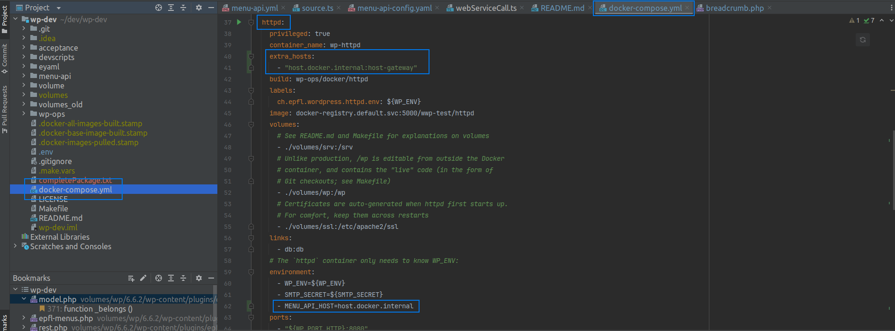
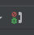

# Menu API

An express server that can serves WordPress menu.


## Development

### Prerequisite

* access to the wp-veritas API
* some dev sites running:
    * wp-httpd
    * wp-httpd/campus
    * wp-httpd/campus/services
    * wp-httpd/campus/services/websites
* To make tests work you need to have these sites locally:
```
SITE_ORIGINAL_URL=https://www.epfl.ch/campus/ SITE_ANSIBLE_IDENTIFIER=www__campus RESTORED_SITE_DIR_NAME=campus ./local-restore-from-restic.sh
SITE_ORIGINAL_URL=https://www.epfl.ch/campus/services/ SITE_ANSIBLE_IDENTIFIER=www__campus__services RESTORED_SITE_DIR_NAME=campus/services ./local-restore-from-restic.sh
SITE_ORIGINAL_URL=https://www.epfl.ch/campus/services/website/ SITE_ANSIBLE_IDENTIFIER=www__campus__services__website RESTORED_SITE_DIR_NAME=campus/services/website ./local-restore-from-restic.sh
SITE_ORIGINAL_URL=https://www.epfl.ch/campus/services/website/canari SITE_ANSIBLE_IDENTIFIER=www__campus__services__website__canari RESTORED_SITE_DIR_NAME=campus/services/website/canari ./local-restore-from-restic.sh
SITE_ORIGINAL_URL=https://www.epfl.ch/campus/art-culture SITE_ANSIBLE_IDENTIFIER=www__campus__art_culture RESTORED_SITE_DIR_NAME=campus/art-culture ./local-restore-from-restic.sh
SITE_ORIGINAL_URL=https://www.epfl.ch/campus/art-culture/museum-exhibitions SITE_ANSIBLE_IDENTIFIER=www__campus__art_culture__museum_exhibitions RESTORED_SITE_DIR_NAME=campus/art-culture/museum-exhibitions ./local-restore-from-restic.sh
SITE_ORIGINAL_URL=https://www.epfl.ch/campus/art-culture/museum-exhibitions/archizoom SITE_ANSIBLE_IDENTIFIER=www__campus__art_culture__museum_exhibitions__archizoom RESTORED_SITE_DIR_NAME=campus/art-culture/museum-exhibitions/archizoom ./local-restore-from-restic.sh
SITE_ORIGINAL_URL=https://www.epfl.ch/labs SITE_ANSIBLE_IDENTIFIER=www__labs RESTORED_SITE_DIR_NAME=labs ./local-restore-from-restic.sh
SITE_ORIGINAL_URL=https://www.epfl.ch/labs/alice SITE_ANSIBLE_IDENTIFIER=www__labs__alice RESTORED_SITE_DIR_NAME=labs/alice ./local-restore-from-restic.sh
SITE_ORIGINAL_URL=https://www.epfl.ch/campus/associations SITE_ANSIBLE_IDENTIFIER=www__campus__associations RESTORED_SITE_DIR_NAME=campus/associations ./local-restore-from-restic.sh
SITE_ORIGINAL_URL=https://www.epfl.ch/campus/associations/list SITE_ANSIBLE_IDENTIFIER=www__campus__associations__list RESTORED_SITE_DIR_NAME=campus/associations/list ./local-restore-from-restic.sh
SITE_ORIGINAL_URL=https://www.epfl.ch/campus/associations/list/adec SITE_ANSIBLE_IDENTIFIER=www__campus__associations__list__adec RESTORED_SITE_DIR_NAME=campus/associations/list/adec ./local-restore-from-restic.sh
SITE_ORIGINAL_URL=https://www.epfl.ch/campus/associations/list/spaceat SITE_ANSIBLE_IDENTIFIER=www__campus__associations__list__spaceat RESTORED_SITE_DIR_NAME=campus/associations/list/spaceat ./local-restore-from-restic.sh
SITE_ORIGINAL_URL=https://www.epfl.ch/about SITE_ANSIBLE_IDENTIFIER=www__about RESTORED_SITE_DIR_NAME=about ./local-restore-from-restic.sh
SITE_ORIGINAL_URL=https://www.epfl.ch/education SITE_ANSIBLE_IDENTIFIER=www__education RESTORED_SITE_DIR_NAME=education ./local-restore-from-restic.sh
SITE_ORIGINAL_URL=https://www.epfl.ch/research SITE_ANSIBLE_IDENTIFIER=www__research RESTORED_SITE_DIR_NAME=research ./local-restore-from-restic.sh
SITE_ORIGINAL_URL=https://www.epfl.ch/innovation SITE_ANSIBLE_IDENTIFIER=www__innovation RESTORED_SITE_DIR_NAME=innovation ./local-restore-from-restic.sh
SITE_ORIGINAL_URL=https://www.epfl.ch/schools SITE_ANSIBLE_IDENTIFIER=www__schools RESTORED_SITE_DIR_NAME=schools ./local-restore-from-restic.sh
```
And then list them into `sites.yaml` file.

### Environment variables

Environment variables are declared in the `menu-api-config.yaml`
- prod environment variables are declared inside ansible

## Run tests locally

To run tests locally:
`npm test` from de test folder

_N.B. you should already have the json file inside `data` folder_

### Run menu-api on localhost

* `npm i`
* set the `LOCAL_ENV=false`
* Change the value of `POD_NAME` with the wp-httpd pod IP address to run the menu-api locally
  * To find the IP address you can run `docker inspect -f '{{range.NetworkSettings.Networks}}{{.IPAddress}}{{end}}' wp-httpd` 
* Start the server locally:
    ```
    npx tsx ./src/app.ts -p ./menu-api-config.yaml
    ```

* open your browser on
    * http://localhost:3001/menus/breadcrumb/?lang=en&url=http://wp-httpd/campus/services/en/it-services/security-it/
    * http://localhost:3001/menus/siblings/?lang=en&url=http://wp-httpd/campus/services/en/it-services/security-it/

### Docker

Inside wp-dev run:
* If containers are already running: `make stop`
* To refresh the image of the menu-api we need to delete it: `docker compose build menu-api`
* Run `make up` to rebuild automatically the new image and run all containers
* Then you can use `docker logs -f menu-api`
* And then to test inside the meni-api container:
```
docker exec -it menu-api curl http://localhost:3001/refresh ; 
docker exec -it menu-api curl http://localhost:3001/menus/breadcrumb/?lang=fr&amp;url=https://wp-httpd/campus/services/ressources-informatiques/&amp;pageType=page&amp;postName=Informatique&amp;homePageUrl=https://wp-httpd/campus/services/fr/
```

### To debug menu-api
* Make sur the wp-httpd image has been contructed with 
```
    extra_hosts:
      - "host.docker.internal:host-gateway"
```
And the environment variable `MENU_API_HOST=host.docker.internal` is configured

Start the debug mode: 
Inside wp-dev run:
* If containers are already running: `make stop`
* Run `make up` to rebuild automatically the new image and run all containers

### Deployment on Openshift 3
In the wp-ops directory run:

- To deploy on test: 
  - Delete manually the image _menu-api-siblings_
  - run `./ansible/wpsible -t menu_api`
- To promote image on **production** environment run: `./ansible/wpsible -t menu_api --prod`

### Deployement on Openshift 4 - test/prod
Follow the doc at https://docs.google.com/document/d/11Kxg4IWH7tMZk_lxds5NsvrYTSU0Pr0PIfKgXcIv-6w/edit?pli=1&tab=t.0
